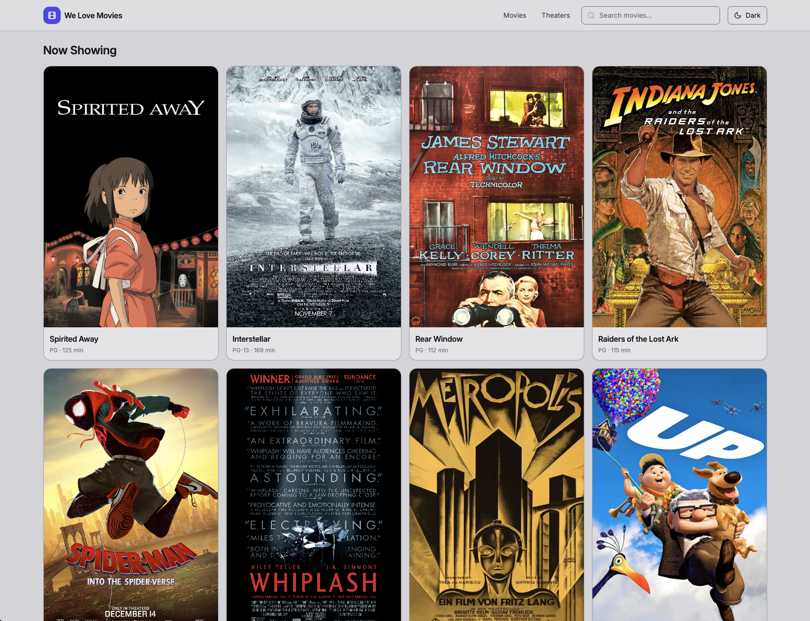
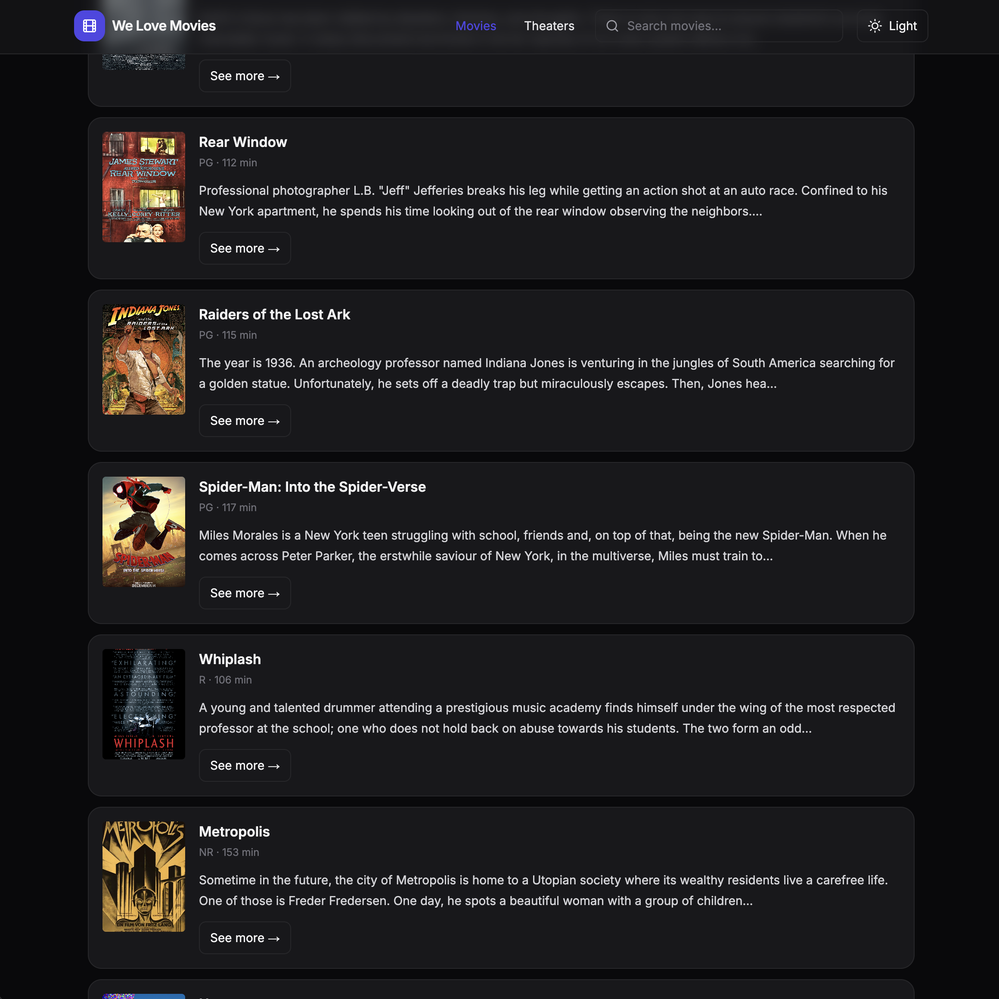
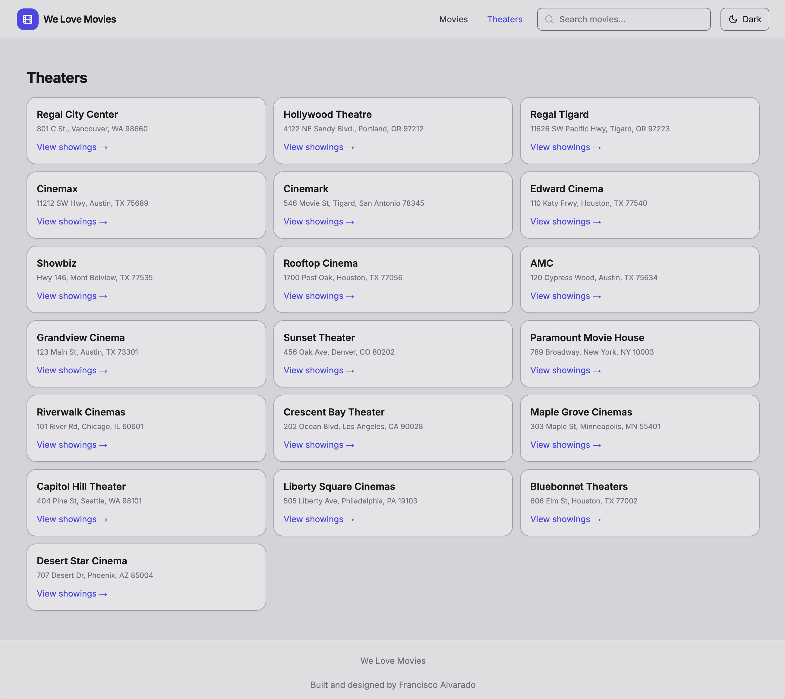
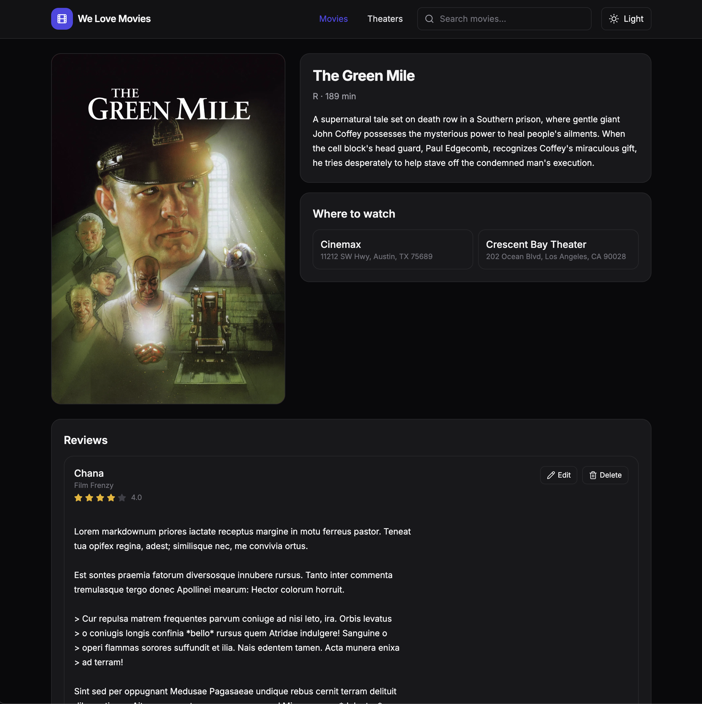

# 🎬 WeLoveMovies (FastAPI + React)

A modernized full-stack movie app rebuilt from the original Express.js + PostgreSQL project.
This version uses **FastAPI (Python)** for the backend and **React + Vite + TailwindCSS** for the frontend.



---

## ✨ Features
- Browse movies with posters, descriptions, ratings, and runtime.
- Dark mode toggle with system preference detection.
- Responsive, modern UI using TailwindCSS.
- Movie detail pages with:
  - **Reviews** (CRUD support)
  - **Theaters** showing current screenings
- Theater list pages showing all theaters with their now-playing movies.
- In-memory seed data for easy setup (movies, theaters, reviews).

---

## 🛠️ Tech Stack
**Frontend:**
- React 18 (Vite, TailwindCSS, React Router v7, React Icons, Lucide React)

**Backend:**
- FastAPI (Python 3.13)
- Uvicorn
- Pydantic models
- In-memory seed services (replaceable with DB later)

---

## Project Structure

```
movie-app/
  ├── backend/
  │   ├── api/routers/      # FastAPI routers
  │   ├── services/         # Business logic
  │   ├── seeds/            # Seed data (movies, theaters, reviews)
  │   └── main.py           # FastAPI entrypoint
  ├── frontend/
  │   ├── src/components/   # UI components
  │   ├── src/home/         # Home + movie pages
  │   ├── src/lib/          # API client
  │   └── App.jsx
  ├── package.json
  └── README.md
```

---

## 📸 Screenshots

### Dashboard (Light & Dark)


### Movies & Theaters





---

## 🚀 Getting Started

### Prerequisites
- Node.js ≥ 18
- Python ≥ 3.11
- npm & pip available

### 1. Clone the repo
git clone https://github.com/falvarado7/movie-app.git
cd movie-app

### 2. Install frontend deps
cd frontend
npm install

### 3. Setup backend venv
cd ../backend
python3 -m venv .venv
source .venv/bin/activate
pip install -r requirements.txt

### 4. Run both servers
(from repo root)
npm run dev

